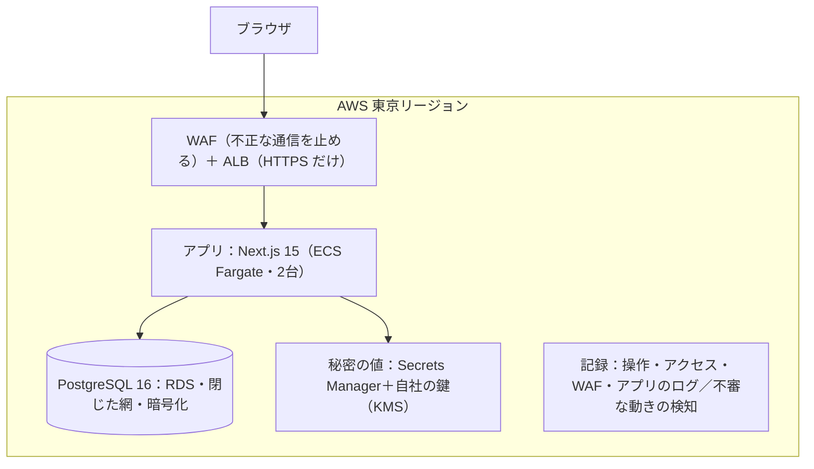

# 人事デスク（JINJI DESK）

**採用を担う人が、選考の実務と、採用・人件費の判断を同じ場所で行うための道具**（旧称：HR Frameworks）

G's ACADEMY 卒業制作。採用コンサルタントの本人が、自分の実務で要るものを設計し、1人で作っています。

> **ソースコードは非公開です。** 採用の個人情報を扱う製品のため、リポジトリは公開していません。このリポジトリは、提出用の概要と構成の資料です。

## デモ（審査用）

- URL：https://demo.jinji-desk.com
- ログイン：「デモ用パスワード」の欄にパスワードを入れて「デモ環境にログイン」（パスワードは提出フォームに記載。このリポジトリには書きません）
- 表示される会社・人・数字は、すべて合成データです。実在の候補者・企業の情報は入っていません
- 使い方（How To Use）：企画書と同じ PDF の後半にあります（提出フォームのリンク）

## 規模（2026-10-05 時点）

| 指標 | 値 |
|---|---|
| ログイン後の画面 | 48 |
| データのモデル | 98 |
| DB の変更（migration） | 127 本 |
| 自動テスト | 3,994件（307ファイル・純関数＋実DB統合 / Vitest。GitHub で全件を実行し、すべて合格） |
| 設計判断の記録（ADR） | 23 本 |
| 開発体制 | 1人（AI と協働：Claude Code） |

## できること（デモで確かめられるもの）

1. **今日やることから始まる** — 面接・未対応・判定待ち・期限切れの依頼を「タスク」に集め、押すと該当の応募者に直行します。
2. **応募から内定まで** — 応募者一覧（絞り込み・列設定・CSV 書き出し）、求人ごとの選考パイプライン（ドラッグで段階を移す）、面接の評価、内定通知書（保存履歴・版の比較・等級の年収レンジとの照合）。
3. **経営と人材** — 採用の計画と実績の差、採用単価、職種ごとの回収期間、退職の状況を1枚で見ます。数字はすべて記録から計算し、助言の文は出しません。
4. **人件費シミュレータ** — 人数を動かすと粗利・人件費・利益がその場で動きます。案を保存して並べて比べ、理由を書いて「決める」と、決めた日・人・理由が残ります（理由なしでは決められません）。
5. **媒体と紹介会社** — 媒体実績（目安との比較）、掲載の管理、CSV 取込（媒体の募集名と自社の求人の対応を学習し、次回から自動で当てる）。
6. **会社ごとの分離** — 1人が複数の会社を担当でき、画面の左上で切り替えます。会社をまたいでデータは見えません（ORM の拡張とデータベースの行レベルの権限の二重で守っています）。
7. **AI** — 求人票（PDF・Word）の読み取り、応募者の書類選考（経歴の要約と求人の要件から、軸ごとの評価と総合スコアを出す）、人事制度の案に AI を使います。AI に送る前に、氏名・メール・電話などを自動で伏せます。デモは合成データだけなので AI につないでいます。実データで AI を使うのは、送信先との契約と開示がそろってからです。

## 構成

- **すべて AWS 東京**：画面・データ・記録を日本に置きます。データベースが遠いと、会社ごとの分離のための往復が積み上がり、1画面が5〜38倍遅くなることを実測して決めました。
- **設計図で管理**：AWS の構成は AWS CDK で書いています。デモと本番は同じ設計図から作ります（本番は、最初の導入企業が決まってから作ります）。
- **反映**：版の印（git の sha）を入れ物に焼き込み、外から見て新しい版が動いていることまで確かめてから終わります。失敗すると前の版へ自動で戻ります。

## 技術

TypeScript・Next.js 15（App Router・Server Components / Server Actions）・React 19・Prisma 6・PostgreSQL 16・NextAuth v5・CSS Modules + Radix UI・Vitest・AWS（ECS Fargate・RDS・ALB・WAF・Secrets Manager・KMS・CloudTrail・GuardDuty）・AWS CDK・Claude（Anthropic）
