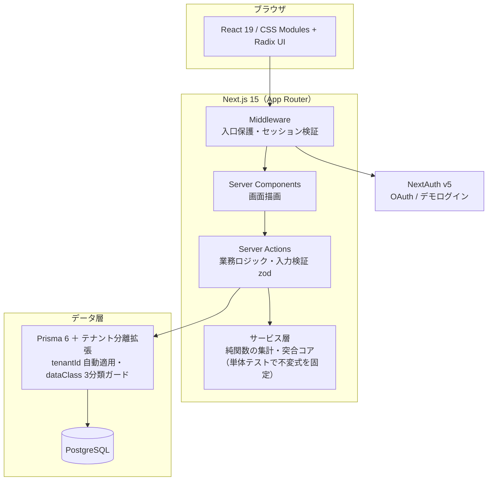

# hr-platform

**採用コンサルタントの運用知見をそのまま実装した、AI前提の採用管理システム（ATS）**

G's ACADEMY 卒業制作。実際の採用現場のオペレーションを題材に、要件→実装→採用担当者レビュー→改修のループを回しながら開発しています。

> **ソースコード・アプリ本体は非公開です。** 業務上の採用データ（個人情報）を扱うため、個人情報保護・機密保持の観点でリポジトリと本体の公開は行っていません。本リポジトリは提出用の概要・構成資料です。

## デモ環境（審査用）

合成（ダミー）データのみで動くログイン可能なデモ環境を用意しています。

- URL: （提出フォームに記載）
- 入口のBasic認証・デモログインのパスワード: （提出フォームに記載・本リポジトリには記載しません）
- デモ環境に実在の候補者・企業の情報は一切含まれていません

## 規模

| 指標 | 値 |
|---|---|
| 画面数 | 25 |
| コード行数 | 50,000+ 行（テストコード込み） |
| 自動テスト | 430+ 件（純関数＋実DB統合 / Vitest） |
| DBマイグレーション | 26 本 |
| 開発体制 | 1人 × 約3.5ヶ月（AI協働開発 / Claude Code） |

## 何が新しいか

1. **タスク駆動の日次運用** — 未対応・返信待ち・今週の面接をタスクに集約し、1クリックで該当応募カードへ直行。「一覧を眺める」ではなく「今日やることを消化する」動線。
2. **根拠を示す適合判定** — 求人要件（MUST/WANT）×候補者属性の突合を判定根拠つきで表示。職歴テキストから経験年数・学歴・スキルを決定的ロジックで自動抽出。
3. **計画×実績×費用の一気通貫** — 採用計画からファネル逆算で必要応募数を算出。経路別チャネル調達計画と実応募を突合し、紹介手数料の自動算定・媒体予算からCPA（採用単価）まで一枚で追える。
4. **実務のままの取込** — 主要求人媒体のCSVエクスポートをそのまま取込。経路名→紹介会社の対応を学習し、2回目からは自動帰属。
5. **マルチテナント×個人情報保護** — テナント分離をORM拡張で強制。個人データを3分類（REAL/SYNTHETIC/ANONYMIZED）で管理し、開発環境では実データの読み書きを機械的に遮断。匿名化パイプラインも実装済み。
6. **AI前提の設計** — 「企業の人事フォルダが製品内で完結し、AIがローカルフォルダのように読める」構造を目指す。AI機能は個人情報保護のゲート通過後に解禁する二段構え（現時点では未解禁。適合判定・属性抽出は決定的ロジックで動作）。

## システム構成

### 設計上のこだわり

- **算数が閉じる集計** — 「合計は常に窓内の全応募・全承諾と一致する」不変式をテストで固定。ダッシュボードの数字が画面間で食い違わない
- **テナント分離の強制** — アプリコードの書き忘れに依存せず、ORM拡張が全クエリに tenantId を自動適用。登録漏れはテストで検出
- **個人情報の3分類（dataClass）** — REAL / SYNTHETIC / ANONYMIZED をデータ行単位で持ち、開発環境では REAL の読み書きをブロック
- **設計判断はADRで文書化** — アーキテクチャ決定の経緯・却下案・ロールバック手順まで記録
- **架空の数字を出さない** — 承諾ゼロのCPA・データ未入力の費用は「0円」ではなく「算出不能」として表示

## 主な画面

| 領域 | 画面 |
|---|---|
| 日次運用 | ダッシュボード（今日のタスク）／タスク一覧／面接日程（週次・ics出力） |
| 候補者管理 | 応募者一覧・詳細（適合判定・対応履歴）／選考パイプライン（カンバン） |
| 取込 | CSV取込（複数媒体対応・経路学習・属性自動充填） |
| 求人 | 求人管理ボード（媒体掲載×応募実績×ファネル・期間フィルタ）／求人編集 |
| 計画・分析 | 採用計画（計画対実績・ファネル逆算・チャネル調達計画・費用/CPA）／媒体実績／レポート |
| 運用支援 | メールテンプレート（差込・日程候補生成）／紹介会社台帳（手数料率）／媒体リンクハブ |

## 技術スタック

Next.js 15（App Router / Server Actions）・React 19・TypeScript・Prisma 6・PostgreSQL・CSS Modules＋Radix UI・NextAuth v5・Vitest・zod

## 開発プロセス

- 実際の採用現場のオペレーションを題材に、秘密保持契約に基づく正規業務の運用の中で「実務と同じ判断が製品上で再現できるか」を検証しながら改良
- 採用担当者による実機レビューと、新規導入ペルソナ3名による全画面レビューを実施し、指摘を優先度順に改修へ反映
- 1人開発×AI協働（Claude Code）。設計・実装・テスト・レビューのループを1日単位で回す
